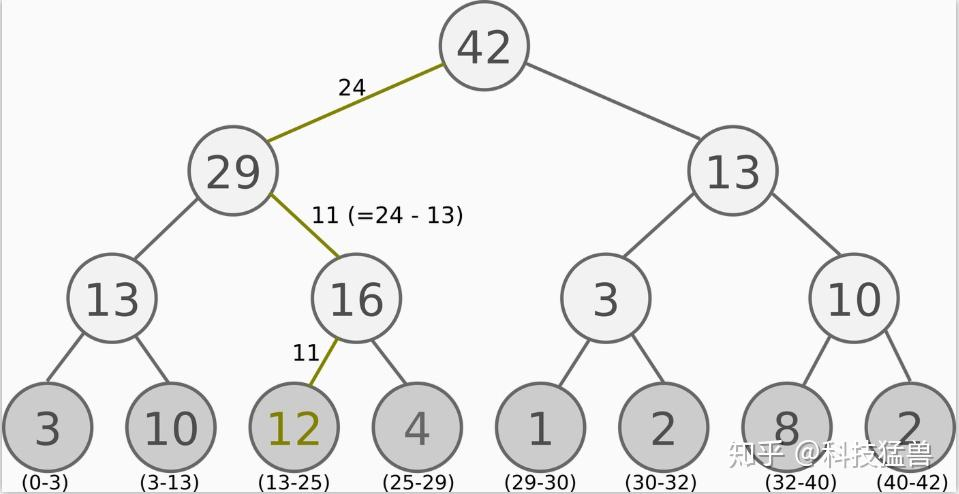
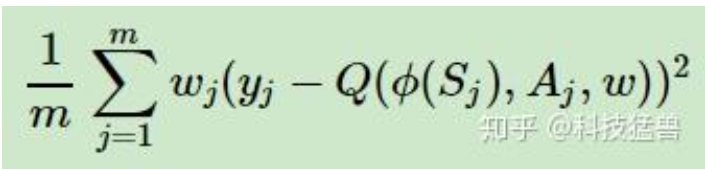

# PER
1. concept
- 依据TD-error确认优先级 p，然后优先级越高，均匀采样时占据区间越大，依次原则建立sumtree

2. error修正：

其中权重$w_j$计算方式如下：
```python
min_prob = np.min(self.tree.tree[-self.tree.capacity:]) / self.tree.total_p
prob = p / self.tree.total_p
ISWeights[i, 0] = np.power(prob/min_prob, -self.beta)
```