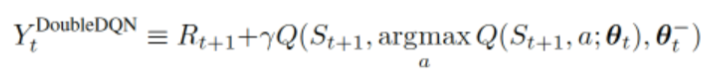

# double DQN
1. concept:
在Double DQN里面，我们选择action时用新参数的Q Table去选，而真正取Q值的时候为了防止这玩意太大，就索性从老参数的Q Table中去选

2. 和DQN的区别：
```python
if self.double_q:
    max_act4next = torch.argmax(q_eval4next, dim=1)
    selected_q_next = q_next[batch_index, max_act4next]
else:
    selected_q_next = torch.max(q_next, dim=1)[0]
```
3. Q值对比
