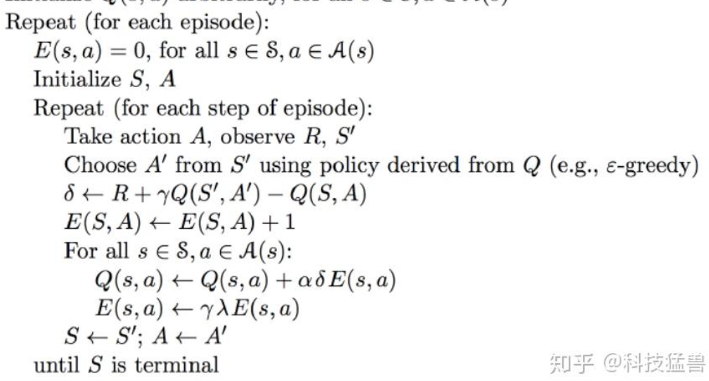

# Sarsa

1. concenpt
采取行动a，获得及时奖励R, 得到下一状态S_,依据该状态选中下一状态需要的a_,得到Q,使用E存储步入当前的所有轨迹一起更新


2. code
./Sarsa_lambda_maze

3. 与Sarsa不同：
- Q table update:
    self.eligibility_trace 记录到当前state的轨迹，然后将error按照轨迹进行传播
    ``` python
    def learn(self, s, a, r, s_, a_):
        self.check_state_exist(s_)
        q_predict = self.q_table.loc[s, a]
        if s_ != 'terminal':
            q_target = r + self.gamma * self.q_table.loc[s_, a_]  # next state is not terminal
        else:
            q_target = r  # next state is terminal
        error = q_target - q_predict

        # increase trace amount for visited state-action pair

        # Method 1:
        # self.eligibility_trace.loc[s, a] += 1

        # Method 2:
        self.eligibility_trace.loc[s, :] *= 0
        self.eligibility_trace.loc[s, a] = 1

        # Q update
        self.q_table += self.lr * error * self.eligibility_trace

        # decay eligibility trace after update
        self.eligibility_trace *= self.gamma*self.lambda_
    ```